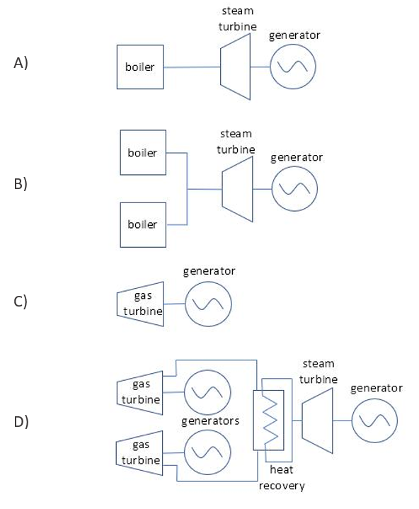

# EPA—EIA Power Sector Data Crosswalk

A data crosswalk to integrate U.S. power sector emission and operation data from the Environmental Protection Agency (EPA) and Energy Information Administration (EIA). Provided in this repo are both the outputs of the crosswalk (csv and xlsx format), the R scripts, and a Quarto Document that generates these outputs.

> Notice: This is a work in progress. EPA's Clean Air Markets Division (CAMD) continues to refine its methodology and quality assurance procedures and will provide information on updates as necessary.

> Update (v0.3): As of October 2022, EPA has added manual matches through a unit-by-unit investigation as well as new datasets, as described below. EPA has also fixed an issue with the sequence numbers (a column added to maintain the order of the units in Excel), resulting in changes from v0.2.

## Background

------------------------------------------------------------------------

EPA and EIA provide two of the most comprehensive and commonly used data sets about the electric power sector. These two data sets include information on emissions, electricity generation, fuel use, operations, and attributes of power plants across the United States. Many researchers and data users find useful information in both data sets. However, key differences in the purpose and manner of data collection by these agencies contribute to difficulties in merging the two data sets. In providing this crosswalk, which relates key identifiers assigned to power plants and units used by both agencies, EPA is hoping to make it easier to integrate both data sets.

> Update (v0.3): In addition, EPA is providing code to facilitate matching to two other relevant EPA datasets: [Facility Registry Service (FRS)](https://www.epa.gov/frs) identifiers and [National Electric Energy Data System (NEEDS)](https://www.epa.gov/power-sector-modeling/national-electric-energy-data-system-needs-v6) identifiers. Some additional information about these two datasets is provided below.

The crosswalk is available as a spreadsheet (xlsx) and delimited text file (csv) for those who are just looking to integrate the two data sets. The R scripts for producing the crosswalk from the two data sets are also available for those interested in how it was made or adapting it. Please see "Contributing to the Crosswalk" for more information on how to improve it.

### What facilities are included in each data set?

Generally speaking, EPA collects the [Power Sector Emissions Data](https://www.epa.gov/airmarkets/power-sector-emissions-data) from fossil fuel-fired electric generating units (EGUs) over 25 MW in nameplate capacity. EIA collects data on all EGUs (including nuclear and renewables) that are located at a plant that is over 1 MW in nameplate capacity and connected to the electricity grid.

> Update (v0.3): FRS assigns facility identifiers to facilities that submit data to EPA under any program, including EGUs. NEEDS combines the list of EGUs from both the Power Sector Emissions Data and EIA datasets, while assigning its own identifiers to those EGUs.

### How are these data collected?

EGUs that submit data to EPA generally use continuous emissions monitoring systems (CEMS) and data acquisition and handling system to collect emissions and operations data. EGUs submit the hourly data to EPA every calendar quarter using EPA-provided data validation and reporting software. EGUs submit data to EIA through various surveys with various reporting periods.

### Why are these data collected?

EPA is empowered to collect the [Power Sector Emissions Data](https://www.epa.gov/airmarkets/power-sector-emissions-data) to ensure compliance with certain EPA and state air quality regulatory programs that affect the electric power sector. EIA collects a variety of energy data to provide independent analysis to the public.

### What is the temporal resolution of each data set?

EPA collects hourly emissions and operation data at the combustion unit (e.g., boiler) level. Power plants submit these data to EPA every calendar quarter. Generally, EIA provides monthly and annual data at the power plant and/or generating unit levels.

> Update (v0.3): NEEDS contains data used for modeling future power sector outcomes in the [Integrated Planning Model (IPM)](https://www.epa.gov/power-sector-modeling). FRS IDs are assigned to facilities that are a part of at least one of several national and state information/data/regulatory programs. FRS IDs associated with EGUs are unlikely to change, as their underlying Plant IDs are unlikely to change. New or retired EGUs would be added or removed from the FRS in accordance with updates to the EPA or EIA databases.

### What is the lowest level of spatial aggregation for each data set?

EPA and EIA both collect unit-level data. However, there is often confusion about what EPA considers a "unit" versus what EIA considers a "unit."

In general, a steam power plant has a boiler that combusts fuel used to produce steam, the energy of the steam is used to rotate a steam turbine and a generator that converts the kinetic energy of rotation into electrical energy (refer to Figure 1.A below). Because EPA's purpose for collecting data is environmental compliance, EPA defines a unit as the source of emissions, the combustion unit (e.g., boiler). On the other hand, EIA is primarily focused on collecting data on electrical generation, so EIA defines a unit as the source of electricity, the generator. While many power plants have a one-to-one relationship between boilers and generators, many do not. As in Figure 1.B below, there can be two (or more) boilers that serve one generator. In EPA's database, the plant illustrated in Figure 1.B would list two units (two boilers); in EIA's database, this plant would list only one unit (one generator).

Like steam power plants, gas turbines can also have one-to-one relationships (Figure 1.C) or complex configurations. Figure 1.D illustrates a common natural gas combined cycle configuration with multiple gas turbines providing excess heat to a single steam turbine. In EPA's database, the plant in Figure 1.D would list two units (two gas turbines); in EIA's database, this plant would list three units (two gas turbines/generators and one steam turbine/generator).

Figure 1. Fossil Fuel-Fired Power Plant Diagrams

Each power plant is identified by an Office of Regulatory Information Systems Plant Location code (ORISPL or ORIS), a unique plant identifier. With a few exceptions (refer to "Methodology" for more information), the unique IDs are consistent between EPA and EIA. In the EIA database the ID is called a "Plant ID", while in the EPA database it's called an "ORIS code". This ID may also be referred to as an "ORISPL", "ORISPL code", "Facility ID", or "Facility code", among other names. This crosswalk will use the term "Plant ID" for the power plant identifier. The boiler and the generator have separate IDs. These IDs may be the same (for example, the boiler ID in Figure 1.A may be listed as 1 with the associated generator ID also listed as 1), but they may be different, which creates difficulties in joining EPA and EIA data. In addition, the IDs for the same plant component may differ between the two data sets due to reporting inconsistencies.

For more information on EPA's Power Sector Emissions Data, see <https://www.epa.gov/airmarkets/power-sector-emissions-data>.

For more information on EIA's electricity data, see <https://www.eia.gov/electricity/data/guide/>.

### How do I cite the crosswalk data?

Huetteman, Justine; Tafoya, Johnathan; Johnson, Travis; and Schreifels, Jeremy. 2021. EPA-EIA Power Sector Data Crosswalk. Accessible at www.epa.gov/airmarkets/power-sector-data-crosswalk.

## Methodology

------------------------------------------------------------------------

In general, the crosswalk R script matches EPA data and EIA data based first on exact matches of unique identifiers followed by matches based on algorithms that detect similar matches of unique identifiers, but may not be exact (i.e., "fuzzy matching"). This second type of matching resolves many of the cases where there are reporting discrepancies between data submitted to EPA and to EIA.

EPA data are retrieved using the [Clean Air Markets (CAM) API](https://www.epa.gov/power-sector/cam-api-portal). EIA data are retrieved from the Form [EIA-860](https://jira.epa.gov/browse/EIA-860) and [EIA-923](https://www.eia.gov/electricity/data/eia923/). Note some EPA units do not have an associated generator ID in EPA's data (refer to "Important Notes" section below).

The R script uses the following tiered approach to match EPA data to EIA data at each facility:

1.  The EPA Plant ID and generator ID are matched to the EIA Plant ID and generator ID (from EIA-860 3_1_Generator_Y{data year}) according to these steps:

    i\. Matches and exclusions from the `manual_matches.xlsx` file are pulled in before any matching occurs to prevent duplicates

    ii\. Exact matching between both data sets

    iii."Fuzzy" matching between both data sets

2.  The EPA Plant ID, generator ID, and unit ID are matched to the EIA Plant ID, generator ID, and boiler ID (from EIA-860 6_1_EnviroAssoc_Y{data year}) according to these steps:

    i\. Matches and exclusions from the `manual_matches.xlsx` file are pulled in before any matching occurs to prevent duplicates

    ii\. Exact matching between both data sets

    iii\. "Fuzzy" matching between both data sets

3.  The results from Steps 1 and 2 are joined, resulting in a set of comprehensive matches that have all EPA identifiers and all EIA identifiers where they exist. EPA units that did not match in any step are added to the crosswalk with an indicator that they were unmatched.

Manual matches between EPA data and EIA data that would not be captured via exact matching or fuzzy matches, are added to the crosswalk from the `manual_matches.xlsx` file. Any EPA units in the manual match file that should be excluded from the matching process, mostly due to the lack of a connection to the electricity grid (e.g., industrial boilers), are added to the crosswalk with an indicator that they were manually excluded.

Due to the complex one-to-many, many-to-one, and many-to-many relationships between units/boilers and generators, EIA boiler ID data must be matched to EPA data in a separate step. In addition, as stated previously, sometimes the units/boilers and generators, though connected, do not have the same unique identifier, which would preclude cross-matching based on EPA generator ID and EIA boiler ID.

Within each matching step, there are sub-steps that perform the exact and "fuzzy" matching processes. The first sub-step is an exact match on the EPA and EIA identifiers. The next sub-steps each perform an operation on the identifiers to modify each of them to a common state. This modification is performed on the original identifier and the result is placed in a field of the same name preceded by "mod\_" (e.g. `epa_unit_id` and `eia_boiler_id` are each modified in Step 2b to remove special characters and whitespaces. The result of the modification is placed in the `mod_epa_unit_id` and `mod_eia_boiler_id` fields, respectively).

In rare instances, the Plant IDs do not match between EPA and EIA's databases. These discrepancies were discovered through the production of [eGRID](https://www.epa.gov/egrid) and are regularly tracked and updated with new eGRID releases. In the crosswalk R script, these discrepancies are accounted for before any matching occurs–EIA's plant ID is modified (`mod_eia_plant_id`) to match EPA's plant ID and includes a field indicating that the plant ID has been changed (`plant_id_change_flag`).

Other discrepancies or missing data may exist and are manually investigated and added to the `manual_matches.xlsx`. In the R script, these matches are done first. This helps remove duplicates and improve accuracy. If other manual matches are found, they will be added to this file, and anyone can create a pull request adding matches and an EPA staff member will review the pull request to incorporate the new matches.

> Update (v0.3): Once the matching steps have been made between EPA and EIA data, steps to add FRS IDs and NEEDS IDs will run in the code. These steps will run only if the user has set the options for additional datasets to be included towards the beginning of the code (i.e., “include_FRS” and/or “include_NEEDS” set to TRUE).

> To add FRS IDs, the code calls the [FRS ID REST API](https://www.epa.gov/frs/frs-rest-services). These IDs are joined to EPA data via `epa_plant_id`. These IDs are at the facility level, so all subcomponents (generators and boilers) at one facility will be assigned the same FRS ID (`frs_id`).

> To add NEEDS IDs, the code imports the NEEDS flat file from [November 2018](https://www.epa.gov/power-sector-modeling/national-electric-energy-data-system-needs-v6), which is downloaded from online in `function_include_needs.R`. NEEDS IDs (`needs_unique_ids`) are a concatenated version of the EIA Plant ID, EIA Generator/Boiler ID, and a letter indicating whether the unit is a boiler (“B”) or a generator (“G”). Generators from NEEDS are matched on `eia_plant_id` and `eia_generator_id`. If the unit has an associated `eia_boiler_id`, boilers from NEEDS are matched on `eia_plant_id` and `eia_boiler_id`.

For more information on EPA's CAM API and to sign up for an API key, see <https://www.epa.gov/power-sector/cam-api-portal#/api-key-signup>.

For more information on the [EIA-860](https://jira.epa.gov/browse/EIA-860), see <https://www.eia.gov/electricity/data/eia860/>.

## Output

The resulting crosswalk includes an xlsx spreadsheet (`epa_eia_crosswalk.xlsx`) and csv file (`epa_eia_crosswalk.csv`), which list all boilers and generators in EPA's database with their corresponding EIA boiler and generator if they have a match. Unmatched EPA units are included with a "EPA Unmatched" label in the `match_type` columns. Generators listed in EIA data that are not matched to EPA data are omitted. The fields `match_type_gen` and `match_type_boiler` indicate how the generators and boilers were matched. The fields included in the final crosswalk are listed and described in the table below.

| **Column Name** | **Description** |
|------------------|------------------------------------------------------|
| sequence_number | Row number assigned to each observation. Included for purposes of sorting to original order. |
| epa_state | The state where the facility is located in EPA's data. |
| epa_facility_name | The name of the facility in EPA's data. |
| epa_plant_id | The unique ID (also known as ORIS code/ORISPL code) of the facility in EPA's data. (EPA key) |
| epa_unit_id | The unique ID for a combustion unit at a facility in EPA's data. (EPA key) |
| epa_generator_id | The unique ID for a generator at a facility in EPA's data. (EPA key) |
| epa_nameplate_capacity | The maximum rated output of the generator in EPA's data, prime mover, or other electric power production equipment under specific conditions designated by the manufacturer. Expressed in MW. |
| epa_fuel_type | The primary fuel type for the unit in EPA's data. |
| epa_latitude | The latitude of the facility in EPA's data. |
| epa_longitude | The longitude of the facility in EPA's data. |
| epa_status | The status of the unit in EPA's data. Either OPR (Operating), LTCS (Long-term cold storage), or RET (Retired). |
| epa_status_date | The date on which the status of the unit last changed in EPA's data. For example, the date on which the unit changed from operating to retired. |
| epa_retire_year | The year in which the unit retired in EPA's data. |
| mod_epa_unit_id | The resulting EPA unit ID used to create a match between EPA and EIA. It may be the same as the original if it was matched without modifications. |
| mod_epa_generator_id | The resulting EPA generator ID used to create a match between EPA and EIA. It may be the same as the original if it was matched without modifications. |
| eia_state | The state where the facility is located in EIA's data. |
| eia_plant_name | The name of the facility in EIA's data. |
| eia_plant_id | The unique ID of the facility in EIA's data. (EIA key) |
| eia_generator_id | The unique ID for a generator at a facility in EIA's data. (EIA key) |
| eia_nameplate_capacity | The highest value on the generator nameplate in megawatts rounded to the nearest tenth. Expressed in MW. |
| eia_boiler_id | The unique ID for a steam boiler unit at a facility in EIA's data. (EIA key) |
| eia_unit_type | The prime mover (devices—e.g., gas turbine, steam turbine—that convert fuels to electrical energy via a generator) for an EIA unit. See reference table 2 in [EIA-860](https://jira.epa.gov/browse/EIA-860) LayoutY{data_year}.xlsx or <https://www.epa.gov/sites/production/files/2017-01/egrid_code_lookup.xlsx> |
| eia_fuel_type | The primary fuel type for the unit in EIA's data. |
| eia_latitude | The latitude of the facility in EIA's data. |
| eia_longitude | The longitude of the facility in EIA's data. |
| eia_retire_year | The year in which the unit retired in EIA's data. |
| plant_id_change_flag | A flag to indicate whether the EIA Plant ID was changed to match a EPA ORIS Code according to a list of known discrepancies between EPA ORIS code and EIA Plant ID. The list is linked in the README. |
| mod_eia_plant_id | The resulting EIA plant ID used to create a match between EPA and EIA before any matching occurs. See "plant_id_manual_matches" sheet within the manual matches file. |
| mod_eia_boiler_id | The resulting EIA boiler ID used to create a match between EPA and EIA during Step 2. It may be the same as the original if it was matched without modifications. |
| mod_eia_generator_id_boiler | The resulting EIA generator ID used to create a match between EPA and EIA during Step 2. It may be the same as the original if it was matched without modifications. |
| mod_eia_generator_id_gen | The resulting EIA generator ID used to create a match between EPA and EIA during Step 1, matching EPA generators to EIA generators on EPA and EIA plant and generator IDs. It may be the same as the original if it was matched without modifications. |
| match_type_gen | The type of match made during Step 1, matching EPA generators to EIA generators on EPA and EIA plant and generator IDs. Any applied modifier sub-steps are also indicated in this field. |
| match_type_boiler | The type of match made during Step 2, matching EPA units and generators to EIA boilers and generators on EPA and EIA plant, unit/boiler, and generator IDs. Any applied modifier sub-steps are also indicated in this field. |

> Update (v0.3): Columns for additional datasets - `frs_id`: The FRS ID associated with each observation. - `needs_unique_id`: The NEEDS ID associated with each observation.

## Important Notes

------------------------------------------------------------------------

-   There may be multiple generators associated with one boiler, or multiple boilers associated with one generator. EPA recommends that data users trying to match information (e.g., emissions and generation) from both data sets first decide whether to collapse on boilers or generators within the crosswalk to avoid double counting after matching the two data sets.

-   Some units in EPA's database do not have a generator ID. This may be because some data was not reported to EPA, or the unit does not send electricity to the grid (e.g., it is an industrial unit that is affected by one of EPA's regulatory programs). Many of the units that do not send electricity to the grid have a plant ID that starts with 88 followed by four digits; however, not all non-grid-connected facilities follow this practice. Those with a plant ID that starts with 88 followed by four digits are flagged in the manual match file and left unmatched. EPA is actively investigating other missing generator IDs and is working to fill in gaps where they exist. When new matches are discovered, EPA will add them to the manual match file. EPA also encourages others to contribute manual matches (see Contributing to the Crosswalk: Additions to Manual Matches below). If you notice additional units when re-running the code, it could be due to this ongoing process.

-   Boiler information is reported to EIA for plants where the sum of the nameplate capacity of the steam-electric generators, including duct-fired steam components of combined cycle units, sum to 10 MW or more.

## Contributing to the Crosswalk

------------------------------------------------------------------------

Thanks for taking the time to contribute! You can help improve the crosswalk by identifying mismatched units, adding new matches, and contributing updates to the R scripts.

### Getting Started

The data for this crosswalk can be found from these three sources:

-   EIA data set:

    -   [EIA-860](https://www.eia.gov/electricity/data/eia860/)

        -   Zip file with several xlsx files. Namely, we use "2\_\_\_Plant_Y2018.xlsx" and "3_1_Generator_Y2018.xlsx."

    -   [EIA-923](https://www.eia.gov/electricity/data/eia923/)

        -   Zip file with several xlsx files.

-   EPA data set: [Clean Air Markets (CAM) API](https://www.epa.gov/power-sector/cam-api-portal)

    -   REST API with various endpoints. We use the /facilities endpoint.
    -   Must sign up for an API key [here](https://www.epa.gov/power-sector/cam-api-portal#/api-key-signup).

-   Manual matches file included in repository: (`manual_matches.xlsx`)

    -   Excel file with three sheets including manual matches, EPA unit-generators that should not be matched, and a copy of the Plant ID changes from Section 4.1.1 of the [eGRID Technical Support Document](https://www.epa.gov/egrid/egrid-technical-support-document)

    -   Direct link to xlsx: [epa-eia_plant_id_crosswalk.xlsx](https://www.epa.gov/sites/production/files/2020-09/epa-eia_plant_id_crosswalk.xlsx)

    -   Note: any updates to the eGRID Plant ID crosswalk will be reflected in the "plant_id_manual_matches" sheet within the manual matches file.

The crosswalk script is built using R with [tidyverse](https://www.tidyverse.org/) packages and [styling](https://style.tidyverse.org/).

### Additions to Manual Matches

If you investigate a source that is currently unmatched and find information that leads to a match, please fork the repository and add the match details to the `manual_matches.xlsx` file with a reason and sources that validate the match. An EPA staff member will review the pull-request and if it is a valid match, it will be included in the next release of the crosswalk. Alternatively, you can open a new issue with information about the new match (see the Issues section below). An EPA staff member will review the pull-request and if it is a valid match, it will be included in the next release of the crosswalk.

When adding a new match, make sure to:

-   Input the ID exactly as it is found from the source data. Excel will try to eliminate leading zeros and format some text as dates. (e.g. if the `epa_unit_id` is 001, you must input it as 001 and if `eia_boiler_id` is 1-6, make sure it doesn't get saved as January 6th).
-   Include a reason for the match describing why the identifiers should be matched the way you indicated.
-   Include any sources for information supporting this reason.
-   Test the R script to see if the desired output occurs with the addition of the manual matches.

### Issues

Ensure the issue was not already reported by searching on Github under [issues](https://github.com/USEPA/camd-eia-crosswalk/issues). If you're unable to find an open issue addressing the bug, [open a new issue](https://github.com/USEPA/camd-eia-crosswalk/issues/new/choose).

When writing an issue please write detailed information to help us understand the issue.

For example:

-   The `plant_id`, `boiler_id`, and/or `generator_id` associated with the issue.
-   The step in the methodology where the issue occurs (e.g., Step 2c).
-   The expected and actual results.
-   Any additional data that may be helpful to improve the R scripts or data outputs.

### Pull Requests

Pull requests are always welcome!

-   When you edit the R script, please style according to the [tidyverse styling guide](https://style.tidyverse.org/) (the [styler](https://styler.r-lib.org/) R package is useful to select and style statements).
-   Ensure the pull request description clearly describes the problem and solution

### Examples

To assist users in understanding how to implement the crosswalk, EPA included a short sample analysis (`examples/sample_analysis.Rmd`) that employs the crosswalk to connect EPA and EIA data. In this sample analysis, annual nitrogen oxide (NOx) emission rates are generated for coal-fired EGUs (specifically, generators) in Alabama based on EPA data on NOx emissions and EIA data on net generation for the year 2018. The result is a plot comparing NOx emission rates with electricity output.

## Disclaimer

THE SOFTWARE IS PROVIDED "AS IS", WITHOUT WARRANTY OF ANY KIND, EXPRESS OR IMPLIED, INCLUDING BUT NOT LIMITED TO THE WARRANTIES OF MERCHANTABILITY, FITNESS FOR A PARTICULAR PURPOSE AND NONINFRINGEMENT. IN NO EVENT SHALL THE AUTHORS OR COPYRIGHT HOLDERS BE LIABLE FOR ANY CLAIM, DAMAGES OR OTHER LIABILITY, WHETHER IN AN ACTION OF CONTRACT, TORT OR OTHERWISE, ARISING FROM, OUT OF OR IN CONNECTION WITH THE SOFTWARE OR THE USE OR OTHER DEALINGS IN THE SOFTWARE.
